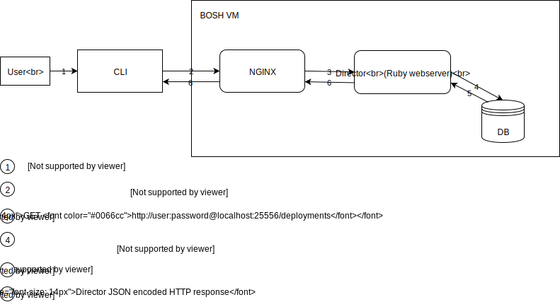
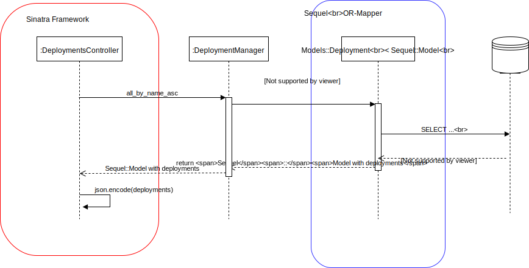

# BOSH deployments flow

* **Summary**:
The flow of a synchronous BOSH CLI command is outlined by the example of `bosh deployments`. This includes the handling of the HTTP requests by an NGINX reverse proxy, the processing by Puma workers, and the database communication.
* **Primary contacts**: [Max Becker](https://github.com/BeckerMax)
* **Last updated**: March 13, 2018
* **Prerequisites**: none
* **Follow-ups**: [`bosh instances --vitals` flow](../bosh-instances-flow/README.md)

## Overview



## CLI

- User types `bosh deployments`
- The `main()` method of the CLI [parses the user input](https://github.com/cloudfoundry/bosh-cli/blob/e94aeebdeed26c840d96c33a02126f523d7b226a/main.go#L30), builds a command and [executes](https://github.com/cloudfoundry/bosh-cli/blob/e94aeebdeed26c840d96c33a02126f523d7b226a/main.go#L35) that command.
The CLI uses [go-flags](https://github.com/jessevdk/go-flags) for parsing and mapping user input to commands.
- In our case, a [`DeploymentsCmd` gets run](https://github.com/cloudfoundry/bosh-cli/blob/e94aeebdeed26c840d96c33a02126f523d7b226a/cmd/cmd.go#L132-L133)
- Before the actual `DeploymentsCmd` gets run, the CLI first [calls the `/info` endpoint of the director](https://github.com/cloudfoundry/bosh-cli/blob/e94aeebdeed26c840d96c33a02126f523d7b226a/cmd/session.go#L145) to set up the session, e.g. to determine authentication type and director version.
- The `DeploymentsCmd#Run()` method will [trigger the HTTP call to the `/deployments` endpoint on the director](https://github.com/cloudfoundry/bosh-cli/blob/e94aeebdeed26c840d96c33a02126f523d7b226a/director/deployments.go#L62)
- The [`DeploymentsTable` renders](https://github.com/cloudfoundry/bosh-cli/blob/e94aeebdeed26c840d96c33a02126f523d7b226a/cmd/deployments.go#L23) the Bosh director response on the UI.

## Bosh Director VM

### NGINX

Nginx is used for security reasons. It handles the https communication. It listens on port 25555 and redirects to 25556 where the director process is running.

On the bosh VM:

Configuration:
```
/var/vcap/jobs/director/config/nginx.conf
```
Access log:
```
/var/vcap/sys/log/director/access.log
```
Access log format:
```
‘$remote_addr - $remote_user [$time_local] ’ ‘“$request” $status $body_bytes_sent ’  ‘“$http_referer” “$http_user_agent” ’  ‘$request_time $upstream_response_time $pipe’;
```

```
==> access.log <==
 27 194.39.131.5 - admin [06/Mar/2018:15:14:48 +0000] “GET /deployments HTTP/1.1” 200 393 “-” “Go-http-client/1.1” 0.009 0.009 .

==> director.stderr.log <==
194.39.131.5 - - [06/Mar/2018:15:14:48 +0000] “GET /deployments HTTP/1.0" 200 393 0.0094
```

### Bosh director sequence diagram



### Ruby Web server

Behind the NGINX on the bosh vm lies a ruby webserver based on Puma.
Puma is a web server for ruby/rack applications and built for concurrency.
Puma creates and handles Sinatra applications which conform to the Rack interface standard for Ruby web frameworks.

The Puma server is started in `bosh/src/bosh-director/bin/bosh-director`.
On startup an application is passed which in our case is defined in Sinatra.
The configuration of routes (meaning which URL paths are matched to which Sinatra controllers) is defined in the [route configuration](https://github.com/cloudfoundry/bosh/blob/f8d711cb0039d876dbd821f8154fe7858332806c/src/bosh-director/lib/bosh/director/api/route_configuration.rb) and also documented in the [API doc](https://bosh.io/docs/director-api-v1.html).

In the [RouteConfiguration class](https://github.com/cloudfoundry/bosh/blob/f8d711cb0039d876dbd821f8154fe7858332806c/src/bosh-director/lib/bosh/director/api/route_configuration.rb#L19) it is defined that calling the deployments endpoint invokes the DeploymentController class:
```
controllers['/deployments'] = Bosh::Director::Api::Controllers::DeploymentsController.new(@config)
```

The [DeploymentsController](https://github.com/cloudfoundry/bosh/blob/f8d711cb0039d876dbd821f8154fe7858332806c/src/bosh-director/lib/bosh/director/api/controllers/deployments_controller.rb#L224) uses the Sinatra DSL to define how to repsond to a request to the deployments endpoint.
```
get '/', authorization: :list_deployments do ...
```

### Sequel

[Sequel](http://sequel.jeremyevans.net/) here is an object relational mapper for mapping records from sql databases to ruby objects.
It provides a DSL for constructing SQL queries and table schemas in ruby code.

Following the execution path of the deployments endpoint call, the [DeploymentsController](https://github.com/cloudfoundry/bosh/blob/f8d711cb0039d876dbd821f8154fe7858332806c/src/bosh-director/lib/bosh/director/api/controllers/deployments_controller.rb) calls the [DeploymentManager](https://github.com/cloudfoundry/bosh/blob/f8d711cb0039d876dbd821f8154fe7858332806c/src/bosh-director/lib/bosh/director/api/deployment_manager.rb) which then works on a [Sequel::Model](http://sequel.jeremyevans.net/rdoc/files/doc/object_model_rdoc.html#label-Sequel-3A-3AModel) named [Bosh::Director::Models::Deployment](https://github.com/cloudfoundry/bosh/blob/f8d711cb0039d876dbd821f8154fe7858332806c/src/bosh-director/lib/bosh/director/models/deployment.rb).

The [Deployment class](https://github.com/cloudfoundry/bosh/blob/f8d711cb0039d876dbd821f8154fe7858332806c/src/bosh-director/lib/bosh/director/models/deployment.rb#L2) is derived from Sequel::Model and wrapps access to the deployments table with associated tables like stemcells, teams, etc.
It also defines how to retrieve these associations, like for example [runtime_configs](https://github.com/cloudfoundry/bosh/blob/f8d711cb0039d876dbd821f8154fe7858332806c/src/bosh-director/lib/bosh/director/models/deployment.rb#L24).
As a performance optimization, when querying deployments, the `deployment_manager` loads some of the associated relations (e.g. stemcells, and releases) eagerly so that they do not need to be loaded from the database one by one in subsequent queries.

### Database

The actual information of the current deployments lies in an SQL database.
This database can be either colocated with the director on the same vm or be some external service like an AWS RDS instance.
Different SQL databases like Postgresql, MySQL or SQLite for testing purposes are supported.
An overview of the director database schema is found [here](https://github.com/cloudfoundry/bosh/tree/f8d711cb0039d876dbd821f8154fe7858332806c/docs/director_schema).

The db queries are found in the director logs on the bosh vm under `/var/vcap/sys/log/director/director.debug.log`.

When calling the `/deployments` endpoint the actual database queries consist of `SELECT` statements on the deployments table and the other associated tables like teams or stemcells:
```
D, [2018-03-13T14:06:24 #19350] [] DEBUG -- Director: (0.000551s) SELECT * FROM "configs" WHERE ("id" IN (SELECT max("id") FROM "configs" WHERE ("type" = 'cloud') GROUP BY "name"))
D, [2018-03-13T14:06:24 #19350] [] DEBUG -- Director: (0.000216s) SELECT * FROM "deployments" ORDER BY "name" ASC
D, [2018-03-13T14:06:24 #19350] [] DEBUG -- Director: (0.000307s) SELECT "teams".*, "deployments_teams"."deployment_id" AS "x_foreign_key_x" FROM "teams" INNER JOIN "deployments_teams" ON ("deployments_teams"."team_id" = "teams"."id") WHERE ("deployments_teams"."deployment_id" IN (1)) ORDER BY "name" ASC
D, [2018-03-13T14:06:24 #19350] [] DEBUG -- Director: (0.000717s) SELECT "stemcells".*, "deployments_stemcells"."deployment_id" AS "x_foreign_key_x" FROM "stemcells" INNER JOIN "deployments_stemcells" ON ("deployments_stemcells"."stemcell_id" = "stemcells"."id") WHERE ("deployments_stemcells"."deployment_id" IN (1)) ORDER BY "name" ASC, "version" ASC
D, [2018-03-13T14:06:24 #19350] [] DEBUG -- Director: (0.000456s) SELECT "configs".*, "deployments_configs"."deployment_id" AS "x_foreign_key_x" FROM "configs" INNER JOIN "deployments_configs" ON ("deployments_configs"."config_id" = "configs"."id") WHERE (("type" = 'cloud') AND ("deployments_configs"."deployment_id" IN (1)))
D, [2018-03-13T14:06:24 #19350] [] DEBUG -- Director: (0.000793s) SELECT "release_versions".*, "deployments_release_versions"."deployment_id" AS "x_foreign_key_x" FROM "release_versions" INNER JOIN "deployments_release_versions" ON ("deployments_release_versions"."release_version_id" = "release_versions"."id") WHERE ("deployments_release_versions"."deployment_id" IN (1))
D, [2018-03-13T14:06:24 #19350] [] DEBUG -- Director: (0.000187s) SELECT * FROM "releases" WHERE ("releases"."id" IN (1, 2))
```

