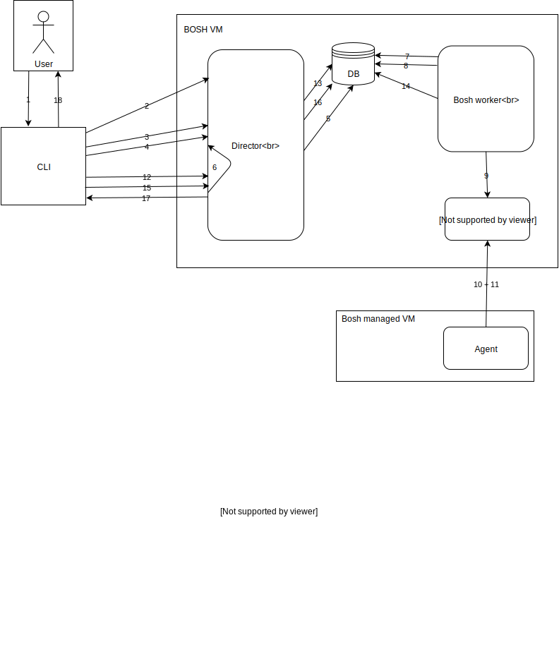

# BOSH instances flow

* **Summary**:
The flow of processing an asynchronous BOSH task is outlined by the example of the CLI command `bosh instances --vitals`. This involves periodic polling of the CLI, director communication with its workers, and the communication with the agents on BOSH deployed vms via a NATS message bus.
* **Primary contacts**: [David Ansari](https://github.com/ansd), [Beyhan Veli](https://github.com/beyhan)

* **Last updated**: March 14, 2018
* **Prerequisites**: [deployments workflow](../bosh-deployments-flow/README.md)
* **Follow-ups**: [upload stemcell workflow](../bosh-upload-stemcell-flow/README.md)

## Overview



## CLI

- When the user runs the command `bosh instances --vitals`, the CLI [queries all deployments](https://github.com/cloudfoundry/bosh-cli/blob/712bfd7271b478ba03c3f604339e2eefbec4647c/cmd/instances.go#L50) from the director (step 3)
- For each deployment, the CLI [queries the full information of the instances](https://github.com/cloudfoundry/bosh-cli/blob/712bfd7271b478ba03c3f604339e2eefbec4647c/cmd/instances.go#L55) [(step 4)](https://github.com/cloudfoundry/bosh-cli/blob/712bfd7271b478ba03c3f604339e2eefbec4647c/director/vms.go#L129) , [waits for the completion of the director task, fetches the results](https://github.com/cloudfoundry/bosh-cli/blob/712bfd7271b478ba03c3f604339e2eefbec4647c/director/task_client_request.go#L128-L142) (steps 12 + 14), and [prints](https://github.com/cloudfoundry/bosh-cli/blob/712bfd7271b478ba03c3f604339e2eefbec4647c/cmd/instances.go#L108-L150) them to the UI (step 17):

```
$ bosh instances --vitals
Using environment '172.18.105.153' as client 'admin'

Task 890
Task 891
Task 890 done

Task 891 done

Deployment 'dummy'

Instance                                    Process State  AZ  IPs       VM Created At  Uptime           Load              CPU    CPU   CPU   CPU   Memory      Swap      System      Ephemeral   Persistent
                                                                                                         (1m, 5m, 15m)     Total  User  Sys   Wait  Usage       Usage     Disk Usage  Disk Usage  Disk Usage
dummy/b09d7c79-8118-405c-8a71-250231fea6f4  running        -   10.0.1.2  -              152d 5h 52m 41s  0.00, 0.00, 0.00  -      0.1%  0.4%  0.2%  4% (85 MB)  0% (0 B)  41% (32i%)  1% (0i%)    0% (0i%)

1 instances

Deployment 'performance'

Instance                                                      Process State  AZ  IPs  VM Created At  Uptime  Load           CPU    CPU   CPU  CPU   Memory  Swap   System      Ephemeral   Persistent
                                                                                                             (1m, 5m, 15m)  Total  User  Sys  Wait  Usage   Usage  Disk Usage  Disk Usage  Disk Usage
throughputramp_instance/d386837c-5907-436f-9ccb-4ba0546f710a  -              -   -    -              -       -              -      -     -    -     -       -      -           -           -

1 instances

Succeeded
```

## Director

- When the CLI queries the end point `/deployment/<deployment-name>/instances?format=full` for a single deployment to get information for all instances of the specific deployment, the director [creates a task to retrieve the `VmState`s and redirects the client to `/tasks/<task-id>` endpoint](https://github.com/cloudfoundry/bosh/blob/e3e2c9c12e457a4fe18dfaa7fab605648b26b1d7/src/bosh-director/lib/bosh/director/api/controllers/deployments_controller.rb#L282-L283) (steps 4 + 6).
- The task from type `Jobs::VmState` is [inserted into the `tasks` database table](https://github.com/cloudfoundry/bosh/blob/e3e2c9c12e457a4fe18dfaa7fab605648b26b1d7/src/bosh-director/lib/bosh/director/job_queue.rb#L8) (step 5).
- The [delayed_job](https://github.com/collectiveidea/delayed_job) framework is used for enqueueing, dequeueing, and execution of jobs.
- This means [one Bosh worker is actually an instance of a `Delayed::Worker`](https://github.com/cloudfoundry/bosh/blob/e3e2c9c12e457a4fe18dfaa7fab605648b26b1d7/src/bosh-director/lib/bosh/director/worker.rb#L24).
- All Bosh workers listen to the available queues [`normal` and `urgent`](https://github.com/cloudfoundry/bosh/blob/e3e2c9c12e457a4fe18dfaa7fab605648b26b1d7/jobs/director/templates/worker_ctl.erb#L27) by default.
- If the property [`director.enable_dedicated_status_worker`](https://github.com/cloudfoundry/bosh/blob/e3e2c9c12e457a4fe18dfaa7fab605648b26b1d7/jobs/director/spec#L77) is set, one of the workers listens only to the [`urgent`](https://github.com/cloudfoundry/bosh/blob/e3e2c9c12e457a4fe18dfaa7fab605648b26b1d7/jobs/director/templates/worker_ctl.erb#L28) queue which is for `bosh ssh` and `bosh vms`.
- So, in our scenario one of the Bosh workers picks up and [executes](https://github.com/cloudfoundry/bosh/blob/e3e2c9c12e457a4fe18dfaa7fab605648b26b1d7/src/bosh-director/lib/bosh/director/jobs/vm_state.rb#L18-L34) the `Jobs::VmState` job from the database (step 7)
- First, the worker [retrieves](https://github.com/cloudfoundry/bosh/blob/e3e2c9c12e457a4fe18dfaa7fab605648b26b1d7/src/bosh-director/lib/bosh/director/jobs/vm_state.rb#L19) all instances for that deployment from the database (step 8)
- The worker uses the [`agent_client`](https://github.com/cloudfoundry/bosh/blob/e3e2c9c12e457a4fe18dfaa7fab605648b26b1d7/src/bosh-director/lib/bosh/director/jobs/vm_state.rb#L106-L107) to send `get_state` to the message bus (step 9) for each instance of the deployment. This is done concurrently so that the worker gets the state for all instances of one deployment in parallel. The `get_state` call uses NATs to send a message to the `agent` and is [synchronous](https://github.com/cloudfoundry/bosh/blob/e3e2c9c12e457a4fe18dfaa7fab605648b26b1d7/src/bosh-director/lib/bosh/director/agent_client.rb#L249-L274) which means that the thread sending the message blocks and waits for a response.
- The NATs message format is defined [here](https://github.com/cloudfoundry/bosh/blob/e3e2c9c12e457a4fe18dfaa7fab605648b26b1d7/src/bosh-director/lib/bosh/director/agent_client.rb#L229)
- Once the director receives a response from the agent, it [writes](https://github.com/cloudfoundry/bosh/blob/e3e2c9c12e457a4fe18dfaa7fab605648b26b1d7/src/bosh-director/lib/bosh/director/jobs/vm_state.rb#L26) the result into the `result_output` column because the `base_job` uses a [`Config.result`](https://github.com/cloudfoundry/bosh/blob/e3e2c9c12e457a4fe18dfaa7fab605648b26b1d7/src/bosh-director/lib/bosh/director/jobs/base_job.rb#L24) which is defined to be a [`TaskDBWriter` writing into the `result_output` column](https://github.com/cloudfoundry/bosh/blob/e3e2c9c12e457a4fe18dfaa7fab605648b26b1d7/src/bosh-director/lib/bosh/director/job_runner.rb#L74).

## Bosh Agent

- The agent [subscribes](https://github.com/cloudfoundry/bosh-agent/blob/d73e889b6a46bfcbc6b13684632269fdc1048f72/agent/agent.go#L67) to the message bus (step 10)
- Each agent request message has a method field which is [mapped](https://github.com/cloudfoundry/bosh-agent/blob/d73e889b6a46bfcbc6b13684632269fdc1048f72/agent/action/concrete_factory.go#L43-L90) to an action in the agent.
- In our case, the agent [executes](https://github.com/cloudfoundry/bosh-agent/blob/d73e889b6a46bfcbc6b13684632269fdc1048f72/agent/action/get_state.go#L55-L99) the `GetStateAction` by [collecting](https://github.com/cloudfoundry/bosh-agent/blob/d73e889b6a46bfcbc6b13684632269fdc1048f72/platform/vitals/service.go#L29-L88) various CPU, memory, and disk stats (step 11).
- The agent sends the stats in [a JSON encoded format](https://github.com/cloudfoundry/bosh-agent/blob/d73e889b6a46bfcbc6b13684632269fdc1048f72/agent/action/get_state.go#L45-L53) back to the director via the message bus.
