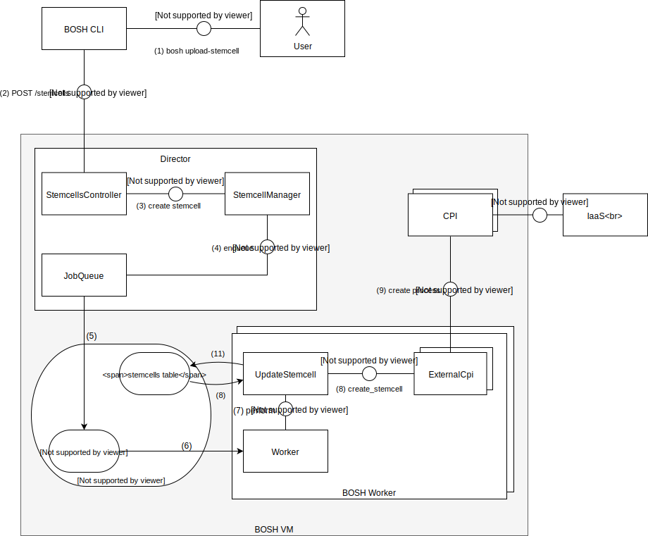

# BOSH upload-stemcell flow

* **Summary**:
The interaction of the BOSH director and a CPI is outlined by the example of `bosh upload-stemcell`. This includes the selection of a specific CPI suitable to handle the uploaded stemcell as well as the information exchange (log, error, results) between director and the CPI.
* **Primary contacts**: [Sebastian Heid](https://github.com/s4heid), [Manuel Dewald](https://github.com/NautiluX), [Beyhan Veli](https://github.com/beyhan)
* **Last updated**: March 19, 2018
* **Prerequisites**: [instances workflow](../bosh-instances-flow/README.md)
* **Follow-ups**: none yet

## Overview

## Communication Outline

1. User executes `bosh upload-stemcell` CLI command
2. CLI executes POST to [StemcellsController](https://github.com/cloudfoundry/bosh/blob/f8d711cb0039d876dbd821f8154fe7858332806c/src/bosh-director/lib/bosh/director/api/controllers/stemcells_controller.rb#L5). The stemcell is either passed via [URL](https://github.com/cloudfoundry/bosh/blob/f8d711cb0039d876dbd821f8154fe7858332806c/src/bosh-director/lib/bosh/director/api/controllers/stemcells_controller.rb#L7) or [multipart file-upload](https://github.com/cloudfoundry/bosh/blob/f8d711cb0039d876dbd821f8154fe7858332806c/src/bosh-director/lib/bosh/director/api/controllers/stemcells_controller.rb#L17)
3. The controller calls the method `create_stemcell_from_url` (or `create_stemcell_from_file_path`) of the [StemcellManager](https://github.com/cloudfoundry/bosh/blob/7558212c36d9233cfd29ac17d994abfab835fa98/src/bosh-director/lib/bosh/director/api/stemcell_manager.rb#L6)
4. These methods instantiate an object [JobQueue](https://github.com/cloudfoundry/bosh/blob/f8d711cb0039d876dbd821f8154fe7858332806c/src/bosh-director/lib/bosh/director/job_queue.rb#L7) class, which wrappes the [delayed_job](https://github.com/collectiveidea/delayed_job) framework.
5. The [delayed_job](https://github.com/collectiveidea/delayed_job) framework is used to enqueue a job for the stemcell upload to [the job queue](https://github.com/cloudfoundry/bosh/blob/f8d711cb0039d876dbd821f8154fe7858332806c/src/bosh-director/lib/bosh/director/job_queue.rb#L13).
6. The BOSH workers use the [delayed_job](https://github.com/collectiveidea/delayed_job) framework, wrapped by the [Worker](https://github.com/cloudfoundry/bosh/blob/f8d711cb0039d876dbd821f8154fe7858332806c/src/bosh-director/lib/bosh/director/worker.rb) class, for dequeueing and execution of previously enqueued jobs. See [bosh-instances-flow](https://github.com/cloudfoundry/bosh-openstack-cpi-shared/tree/master/docs/onboarding-material/bosh-instances-flow#director) for a more detailed explanation.
7. One of the BOSH workers [performs](https://github.com/cloudfoundry/bosh/blob/f8d711cb0039d876dbd821f8154fe7858332806c/src/bosh-director/lib/bosh/director/jobs/update_stemcell.rb#L34) the `UpdateStemcell` job.
8. `UpdateStemcell` checks if the stemcell already exists in the database. Currently this is done via an additional [StemcellManager instance](https://github.com/cloudfoundry/bosh/blob/f8d711cb0039d876dbd821f8154fe7858332806c/src/bosh-director/lib/bosh/director/jobs/update_stemcell.rb#L94) which is left out of the diagram for readability.
9. If the stemcell doesn't exist, the `UpdateStemcell` object invokes [create_stemcell](https://github.com/cloudfoundry/bosh/blob/f8d711cb0039d876dbd821f8154fe7858332806c/src/bosh-director/lib/bosh/director/jobs/update_stemcell.rb#L110) in every `ExternalCpi` object, supported by the uploaded stemcell. The information if a CPI is supported or not is read from the `stemcell.MF` file, which is part of the stemcell tar ball.
10. Every `ExternalCpi` object [starts a CPI process](https://github.com/cloudfoundry/bosh/blob/97e04c092c37e00dce845ab3f75be6fdca7fb95a/src/bosh-director/lib/cloud/external_cpi.rb#L96) which handles the communication with the respective IaaS.
11. The `UpdateStemcell` object [creates](https://github.com/cloudfoundry/bosh/blob/f8d711cb0039d876dbd821f8154fe7858332806c/src/bosh-director/lib/bosh/director/jobs/update_stemcell.rb#L125-L129) an entry for the uploaded stemcell in the [database](https://github.com/cloudfoundry/bosh/blob/7558212c36d9233cfd29ac17d994abfab835fa98/src/bosh-director/lib/bosh/director/jobs/update_stemcell.rb#L125-L129).

## Update Stemcell Job

## Director/CPI Interaction

All CPIs are BOSH releases and the director is configured with the required CPI through the deployment manifest. E.g. the OpenStack CPI job and configuration can be found [here](https://github.com/cloudfoundry/bosh-deployment/blob/68b42eae6b541524190c7ad7f6f518d1f479741e/openstack/cpi.yml#L50-L76). The BOSH release of each CPI specifies which properties need to be set or can optionally be configured. See the specification of the [OpenStack CPI properties](https://github.com/cloudfoundry-incubator/bosh-openstack-cpi-release/blob/39dc3455d9c30970d128924c87239b00594529cb/jobs/openstack_cpi/spec) as an example.

The CPIs are invoked as standalone processes for every CPI request. They can find their specifig configuration at their job location, e.g. `/var/vcap/jobs/openstack_cpi/config/cpi.json` in case of the OpenStack CPI (see [OpenStack CPI start script](https://github.com/cloudfoundry-incubator/bosh-openstack-cpi-release/blob/39dc3455d9c30970d128924c87239b00594529cb/jobs/openstack_cpi/templates/cpi.erb)). In the same way, certificates can be transported to the CPI, if required. In the OpenStack CPI, the [certificate template](https://github.com/cloudfoundry-incubator/bosh-openstack-cpi-release/blob/39dc3455d9c30970d128924c87239b00594529cb/jobs/openstack_cpi/templates/cacert.pem.erb) is rendered to the file `/var/vcap/jobs/openstack_cpi/config/cacert.pem`.

The API of the CPI calls invoked by the director is defined at http://bosh.io/docs/cpi-api-v1.html.

The invocation of the CPI is done in [ExternalCpi](https://github.com/cloudfoundry/bosh/blob/f8d711cb0039d876dbd821f8154fe7858332806c/src/bosh-director/lib/cloud/external_cpi.rb#L74-L108). Input to the CPIs is passed as JSON via STDIN, and output (logs, errors, results) is returned by the CPIs via STDOUT to the director, also in JSON format. Debug information is logged by the CPI via STDERR. The director writes the debug logs as well as the request and response to its debug log, which can be accessed with `bosh task <task_id> --debug`. The CPI logs are written to a separate CPI log file, which you can get with `bosh task <task_id> --cpi`. More details about the communication with the CPIs can be found at http://bosh.io/docs/build-cpi.html#rpc.
